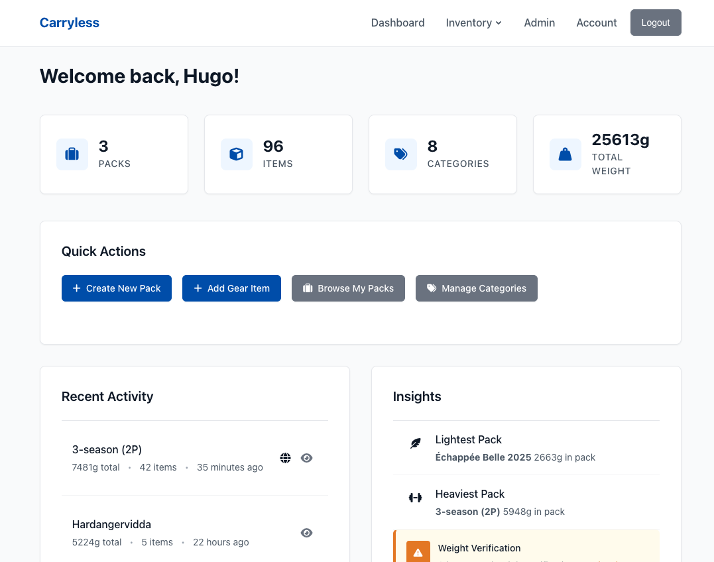

# Carryless

A web application for backpackers to catalog gear and plan packs. Track item weights, organize equipment into packs, and share your setups.

## Requirements

- Go 1.22 or higher
- SQLite (included with most systems)

## Installation

```bash
git clone <repository-url>
cd carryless
go mod download
go build -o carryless .
```

## Running

```bash
./carryless
```

The application runs on http://localhost:8080 by default.

### Configuration Options

Set these environment variables if needed:

```bash
PORT=3000                           # Change port (default: 8080)
DATABASE_PATH=/path/to/database.db  # Database location (default: carryless.db)
```

For email notifications (optional):
```bash
MAILGUN_DOMAIN=your-domain.com
MAILGUN_API_KEY=your-api-key
```

## Usage

1. Create an account at http://localhost:8080/register
2. Add your gear to the inventory
3. Create packs and add items from your inventory
4. Share packs publicly or keep them private

The database is created automatically on first run.

## Screenshots

<details>
<summary>View Screenshots</summary>

### Homepage


### Inventory Management


### Pack Statistics


### Pack Content


</details>